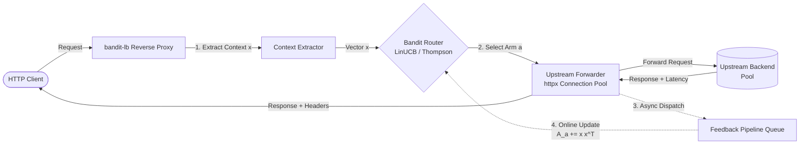

# bandit-lb

> High-performance, asynchronous contextual bandit dynamic request router and load balancer in Python.

[](https://python.org)
[](https://fastapi.tiangolo.com)
[](https://opensource.org/licenses/MIT)
[](https://github.com/astral-sh/ruff)

---

## 1. System Overview

Standard load balancers (Round Robin, Least Connections, Random) rely on static weights or crude connection counts. In modern microservice architectures, upstream backend latencies fluctuate dynamically due to garbage collection pauses, noisy neighbors, and localized network degradation.

**`bandit-lb`** solves this by formulating load balancing as an online **Contextual Multi-Armed Bandit** problem. It observes incoming HTTP request characteristics (path, method, query length, user-agent, payload size), selects the optimal backend arm to minimize end-to-end latency, and updates its regression weights online via a non-blocking asynchronous feedback loop.



---

## 2. Core Architectural Components

### A. Contextual Bandit Decision Engine
* **`LinUCBRouter`**: Disjoint Linear Upper Confidence Bound algorithm. Selects arm $a$ that maximizes:
  $$p_a = \hat{\theta}_a^T x + \alpha \sqrt{x^T A_a^{-1} x}$$
  where $\hat{\theta}_a = A_a^{-1} b_a$ is the ridge regression weight vector and $\alpha$ controls exploration bonus.
* **`LinearThompsonSamplingRouter`**: Bayesian posterior sampling. Samples regression parameters:
  $$\tilde{\theta}_a \sim \mathcal{N}\left(\hat{\theta}_a, v^2 A_a^{-1}\right)$$
  and picks the arm with maximum predicted utility $\tilde{\theta}_a^T x$.
* **Standard Baselines**: `RoundRobinRouter`, `WeightedRandomRouter`, and `LeastConnectionsRouter` implementing the identical `BaseBanditRouter` interface for empirical side-by-side benchmarking.

### B. High-Throughput Async Reverse Proxy
* **FastAPI & Starlette Wildcard Routing**: Handles any incoming HTTP method, headers, query parameters, and streaming payloads.
* **Persistent Connection Pooling**: Long-lived `httpx.AsyncClient` with custom keepalive and pool boundaries.
* **Non-Blocking Telemetry Feedback**: Matrix updates ($A_a \leftarrow A_a + x x^T$) and telemetry recording are dispatched to an in-memory queue (`FeedbackPipeline`), keeping proxy request overhead under $1\text{ ms}$.

### C. Synthetic Upstream Simulator
* Configurable upstream mock backend servers running in-memory or as standalone Uvicorn processes.
* Support for **Normal**, **Gamma**, and heavy-tailed **Pareto** latency distributions with configurable jitter and failure injection ($500$, $503$, timeouts).
* Dynamic reconfiguration via Python API or administrative control routes (`/_control/config`).

### D. Benchmarking & Observability
* **`AsyncLoadGenerator`**: Concurrent async load generation with support for constant, burst, and dynamic perturbation triggers.
* **Metrics & CLI Reporter**: Latency percentiles ($p50, p90, p95, p99$), cumulative regret curves, and ASCII routing distribution charts.

---

## 3. Mathematical Foundations

### Latency Utility & Reward Formulation
Bandits maximize rewards, whereas load balancers minimize latency and cost. `bandit-lb` transforms observed latencies into bounded negative utilities:

$$r = - \min\left(1.0, \frac{\text{latency\_ms}}{\text{max\_expected\_latency\_ms}}\right) - \mathbb{I}(\text{failure}) \times \text{penalty}$$

Rewards are strictly bounded in $[-1.0, 0.0]$, ensuring numerical stability during online matrix inversion.

### Online Sherman-Morrison Updates
For rapid matrix updates without recomputing $O(d^3)$ inverses, `bandit-lb` maintains inverse covariance matrices incrementally:

$$A^{-1}_{t} = A^{-1}_{t-1} - \frac{A^{-1}_{t-1} x x^T A^{-1}_{t-1}}{1 + x^T A^{-1}_{t-1} x}$$

reducing update complexity to $O(d^2)$.

---

## 4. Quickstart & Demonstration

### Installation

```bash
# Clone repository
git clone https://github.com/AgentDudu/bandit-lb.git
cd bandit-lb

# Create virtual environment and install dependencies
python -m venv .venv
.venv\Scripts\activate  # Windows (or source .venv/bin/activate on Linux/macOS)
pip install -e ".[dev]"
```

### Running the Live Demonstration

Run the automated demonstration comparing **LinUCB** against **Round Robin** during a sudden upstream degradation:

```bash
python run_demo.py
```

**Example Output:**
```text
============================================================================
      bandit-lb: Contextual Bandit Dynamic Routing Demonstration
============================================================================
Simulating 3 upstream backends:
  * 'alpha': Fast tier (mean: 6.0ms)
  * 'beta' : Moderate tier (mean: 18.0ms)
  * 'gamma': Slow tier (mean: 45.0ms)

Perturbation Event: At request #50, 'alpha' degrades to 75.0ms!
Executing 120 concurrent requests per load balancer...

[1/2] Running Round Robin baseline workload...
[2/2] Running LinUCB contextual bandit router workload...

============================================================================
           EMPIRICAL PERFORMANCE BENCHMARK: BANDIT vs ROUND ROBIN           
============================================================================

## Performance Comparison Summary
+------------+----------+-------+-----------+----------+----------+----------+--------+----------+
| Strategy   | Requests | RPS   | Mean (ms) | P50 (ms) | P95 (ms) | P99 (ms) | Regret | Errors   |
+------------+----------+-------+-----------+----------+----------+----------+--------+----------+
| RoundRobin |      120 | 142.0 |     36.22 |    30.17 |    74.80 |    82.32 | 3632.1 | 0 (0.0%) |
|     LinUCB |      120 | 174.7 |     27.05 |    20.87 |    79.07 |    92.05 | 2534.0 | 0 (0.0%) |
+------------+----------+-------+-----------+----------+----------+----------+--------+----------+

## Traffic Routing Distributions

 Strategy: RoundRobin
  alpha | ########----------------- |  33.3% (40 reqs)
  beta  | ########----------------- |  33.3% (40 reqs)
  gamma | ########----------------- |  33.3% (40 reqs)

 Strategy: LinUCB
  alpha | ############------------- |  46.7% (56 reqs)
  beta  | ###########-------------- |  42.5% (51 reqs)
  gamma | ###---------------------- |  10.8% (13 reqs)

============================================================================

Benchmark Highlights:
  * Mean Latency Reduction : +25.3% faster with LinUCB
  * Cumulative Regret      : LinUCB (2534.0ms) vs RR (3632.1ms)
  * Dynamic Traffic Shift  : LinUCB reduced traffic to degraded 'alpha' down to 46.7%
```

---

## 5. Python API Usage

```python
import asyncio
from bandit_lb.algorithms import LinUCBRouter
from bandit_lb.proxy import UpstreamForwarder, create_proxy_app
from bandit_lb.telemetry import RewardNormalizer, TelemetryCollector

# 1. Initialize bandit router with registered backends
router = LinUCBRouter(dimension=16, alpha=0.3, arms=["backend-1", "backend-2"])

# 2. Build FastAPI reverse proxy application
app = create_proxy_app(
    router=router,
    backend_urls={
        "backend-1": "http://10.0.0.1:8080",
        "backend-2": "http://10.0.0.2:8080",
    },
    telemetry_collector=TelemetryCollector(),
    reward_normalizer=RewardNormalizer(),
)

# 3. Serve via Uvicorn
# uvicorn app:app --port 8000
```

---

## 6. Development & Test Suites

```bash
# Run full pytest test suite (101+ tests)
pytest -v

# Run Ruff linter and formatting checks
ruff check .
ruff format --check .

# Run Mypy static type checking
mypy bandit_lb/
```

---

## 7. License

Distributed under the MIT License. See `LICENSE` for details.
